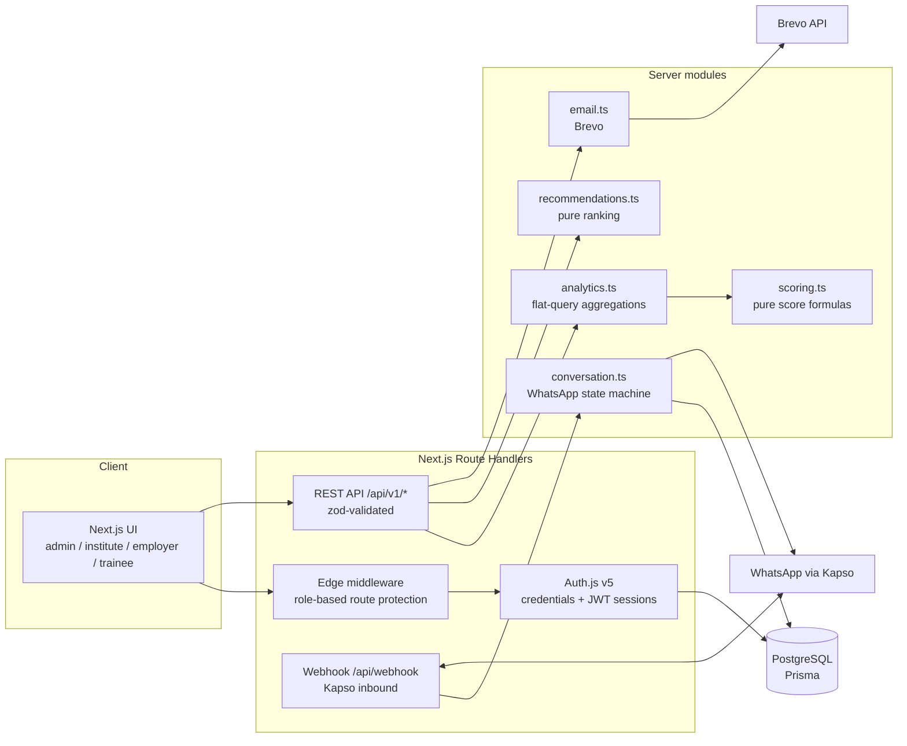
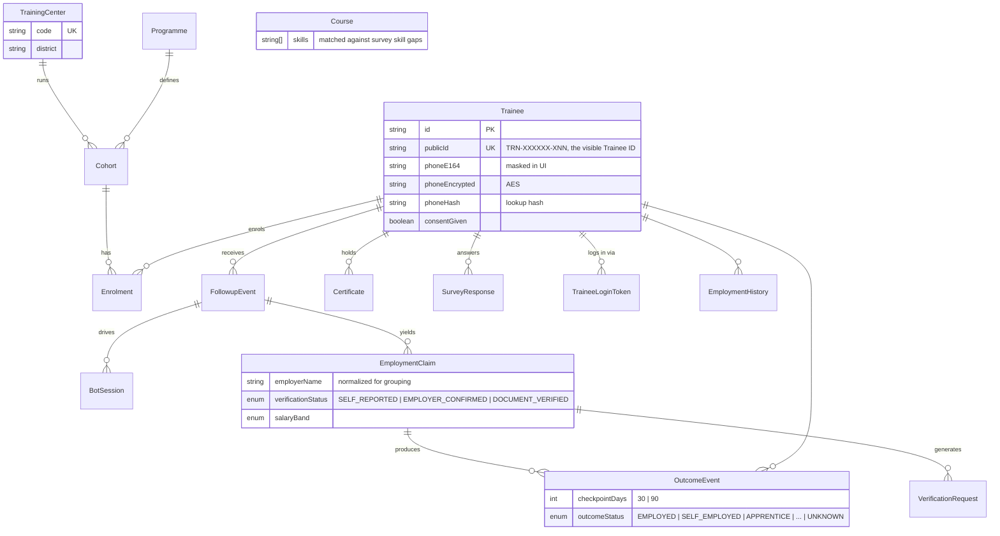

# OutcomeTrack — Longitudinal Skilling Outcomes Platform

> Tracking what happens to trainees *after* certification: placement, retention, wages and career progression — captured over WhatsApp, verified by employers, and benchmarked across training centers for government accountability.

Built for the **Smart India Hackathon** as a demonstration of outcome-based governance for skill development programmes (PMKVY / DDU-GKY / state schemes under MSSDS).

---

## Table of Contents

- [Problem](#problem)
- [Features by Role](#features-by-role)
- [Tech Stack](#tech-stack)
- [Architecture](#architecture)
- [Data Model](#data-model)
- [Getting Started](#getting-started)
- [Environment Variables](#environment-variables)
- [Scripts](#scripts)
- [Authentication & Roles](#authentication--roles)
- [API Reference](#api-reference)
- [Scoring Methodology](#scoring-methodology)
- [WhatsApp Bot](#whatsapp-bot)
- [Testing](#testing)
- [Deployment](#deployment)
- [Project Structure](#project-structure)
- [Demo Credentials](#demo-credentials)
- [Known Limitations & Trade-offs](#known-limitations--trade-offs)
- [Further Documentation](#further-documentation)

---

## Problem

India's skilling ecosystem measures *inputs* (enrolments, certifications) but struggles to measure *outcomes*. Placement data is self-reported by training providers, decays after the 90-day placement window, and is rarely verifiable. Policymakers fund what they can't measure; institutes can't see how they compare to peers; trainees have no way to update their own outcomes; employers have no stake in verification.

## Solution

OutcomeTrack closes the loop with four mechanisms:

1. **Longitudinal capture over WhatsApp** — automated follow-up conversations at 30/90-day checkpoints after certification, in English or Hindi, consent-first.
2. **Evidence-graded outcomes** — every employment claim carries a verification status (`SELF_REPORTED` → `EMPLOYER_CONFIRMED` / `DOCUMENT_VERIFIED`) and evidence level. Scores are verified-weighted, so self-reported data can't inflate a provider's numbers.
3. **Role-based analytics** — government sees scheme-wide trends + a training-agency leaderboard; institutes see per-category peer gaps (average + top quartile); employers see their retention score and rank; trainees see their profile and get course/employer recommendations.
4. **Identity & consent** — every trainee gets a unique, copyable Trainee ID; phone numbers are encrypted + hashed; consent is captured before any data collection and is auditable.

## Features by Role

| Role | What they get |
|---|---|
| **Government admin** | Placement/retention/wage/verification trend graphs vs targets, training-agency leaderboard (overall = 50% placement + 30% academic + 20% volume), recent-activity timeline, trainee lookup by ID |
| **Institute** | Peer-comparison graphs per category (your institute vs peer average vs top quartile vs state target), per-cohort performance table, gap analysis |
| **Employer** | Dedicated login + dashboard: retention score (with numerator/denominator), claims timeline, verification history, wage-band distribution, retention rank vs peers, recent claims |
| **Trainee** | Magic-link (passwordless) login, editable profile (name/email/district/language), prominent copyable Trainee ID, certificates, employment history, outcome checkpoints, course + employer recommendations matched to skill gaps |

## Tech Stack

| Layer | Choice | Notes |
|---|---|---|
| Framework | [Next.js 15](https://nextjs.org) (App Router, Turbopack) | Server components + route handlers |
| Language | TypeScript (strict) | `tsc --noEmit` clean |
| Database | PostgreSQL (Supabase) via [Prisma](https://prisma.io) ORM | Single pooled client, no raw SQL |
| Auth | [Auth.js / NextAuth v5](https://authjs.dev) | Credentials-only (fields-based), JWT strategy, role-aware middleware |
| Transactional email | [Brevo](https://brevo.com) | Magic-link delivery, verified sender |
| WhatsApp | Kapso (Meta Cloud API) | Consent-first conversational state machine |
| UI | Tailwind CSS + shadcn/radix + [Recharts](https://recharts.org) | Dashboard graphs |
| Validation | Zod | Every route body/query validated |
| Testing | Vitest | Pure-module unit tests (scoring, recommendations) |

## Architecture



**Key design decisions**

- **Pure scoring/recommendation modules** (`src/server/scoring.ts`, `src/server/recommendations.ts`) — no I/O, no Prisma; fully unit-tested. Route handlers own the data loading and feed flat aggregates in.
- **Flat-query analytics** (`src/server/analytics.ts`) — a handful of minimal-column Prisma queries + in-memory aggregation instead of deep nested includes.
- **Employer identity is normalized free text** — `employerName` is trimmed/collapsed/uppercased for grouping; there is deliberately no Employer table (claims arrive via chat, unstructured).
- **JWT sessions, no adapter** — credentials login and magic-link verification both mint the same signed session cookie; middleware decodes it at the edge for role checks.
- **Everything audited** — login, consent, claims, bot messages, and admin actions land in `AuditEvent` with actor type/id.

## Data Model



Full schema: [`prisma/schema.prisma`](prisma/schema.prisma) — 16 models, 8 enums. Domain glossary: [`CONTEXT.md`](CONTEXT.md).

## Getting Started

**Prerequisites:** Node.js ≥ 20, a PostgreSQL database (Supabase or local), a Kapso account (optional — the simulator works without WhatsApp).

```bash
# 1. Install dependencies (also runs `prisma generate`)
npm install

# 2. Configure environment
cp .env.example .env
#    ... fill in your values (see table below)

# 3. Push the schema
npm run db:push

# 4. Seed realistic demo data (~500 trainees, 15 cohorts, 5 programmes,
#    enrolments, 30/90-day follow-ups, outcome events)
npx tsx prisma/seed.ts

# 5. Backfill training centers + course catalogue + demo certificates/surveys
#    (idempotent — safe to re-run)
npx tsx prisma/backfill-centers.ts

# 6. Start the dev server
npm run dev
```

Open http://localhost:3000 and sign in from `/login`.

## Environment Variables

| Variable | Required | Purpose |
|---|---|---|
| `DATABASE_URL` | ✅ | PostgreSQL connection string (pooled port for Supabase, e.g. `:6543`) |
| `DIRECT_URL` | ✅ | Direct/migration connection string |
| `AUTH_SECRET` | ✅ | Auth.js JWT signing secret (`openssl rand -base64 32`) |
| `AUTH_TRUST_HOST` | – | Set to `true` for non-Vercel hosts |
| `INTERNAL_API_KEY` | ✅ | Service-to-service key for bot endpoints (`X-API-Key`) |
| `NEXT_PUBLIC_INTERNAL_API_KEY` | – | Same key, inlined for the WhatsApp simulator page |
| `KAPSO_API_KEY` | for WhatsApp | Kapso (Meta Cloud API) credentials |
| `KAPSO_PHONE_NUMBER_ID` | for WhatsApp | Kapso sender phone number id |
| `KAPSO_VERIFY_TOKEN` | for WhatsApp | Webhook verification token (GET handshake) |
| `KAPSO_WEBHOOK_SECRET` | for WhatsApp | HMAC secret for inbound webhook payloads |
| `BOT_BASE_URL` / `BOT_MODE` | – | Optional: push follow-ups to an external bot service when `BOT_MODE=real` (default `mock`) |
| `BREVO_API_KEY` | for email | Brevo transactional email |
| `EMAIL_FROM` | for email | Verified Brevo sender address |
| `APP_BASE_URL` | ✅ | Absolute base URL used in magic links |
| `PHONE_HASH_PEPPER` / `PHONE_ENCRYPTION_KEY` | ✅ | Phone privacy (hash pepper + AES key) |
| `ADMIN_EMAIL` / `ADMIN_PASSWORD` | – | Demo credential overrides (defaults in code) |
| `INSTITUTE_EMAIL` / `INSTITUTE_PASSWORD` | – | Demo credential overrides |
| `EMPLOYER_EMAIL` / `EMPLOYER_PASSWORD` | – | Demo credential overrides |
| `TEST_TRAINEE_PHONE` / `_NAME` / `_EMAIL` | – | Used by `scripts/test-bot-trigger.ts` |

## Scripts

| Command | What it does |
|---|---|
| `npm run dev` | Dev server (Turbopack) |
| `npm run build` / `npm start` | Production build / serve |
| `npm run lint` | ESLint |
| `npm run typecheck` | `tsc --noEmit` |
| `npx vitest run` | Unit test suite (36 tests) |
| `npm run db:push` | Push Prisma schema |
| `npm run db:studio` | Prisma Studio |
| `npx tsx prisma/seed.ts` | Seed demo data |
| `npx tsx prisma/backfill-centers.ts` | Centers/courses/certificates/surveys backfill (idempotent) |

## Authentication & Roles

All sign-in is **fields-based** (email/password or magic link) — no OAuth providers.

| Role | Flow | Landing page |
|---|---|---|
| Government admin | `/login` → Credentials (JWT session) | `/admin/analytics` |
| Institute | `/login` → Credentials | `/institute/analytics` |
| Employer | `/employer/login` → Credentials | `/employer/dashboard` |
| Trainee | `/login` → email → **magic link** → one-time token → verify mints the same JWT session | `/trainee/profile` |

**Session:** signed JWT cookie (`authjs.session-token`), 30 days, `httpOnly`.

**Route protection:** edge middleware decodes the session and checks a role matrix — `/admin/*` (admin), `/institute/*` (institute, admin), `/employer/*` (employer, admin), `/trainees/*` (admin, institute), `/dashboard/*` (admin, institute, trainee). Unauthenticated users are redirected to `/login?redirect=…`; wrong-role users get `?error=unauthorized`. `/employer/login` and `/auth/trainee/*` stay public (the one-time token *is* the credential).

## API Reference

All routes under `/api/v1` are Zod-validated and JSON. List endpoints are paginated (`page`, `limit`).

### Analytics
| Method | Path | Purpose |
|---|---|---|
| GET | `/analytics/government` | Monthly outcome trends vs targets + `trainingCenters` leaderboard |
| GET | `/analytics/institute` | Institute trends + per-category peer gaps (avg, p75, gap) + per-cohort rates |
| GET | `/kpis/overview` | Dashboard KPIs + recent activity feed |

### Trainee
| Method | Path | Purpose |
|---|---|---|
| POST | `/trainee/magic-link` | Issue a one-time magic link (email via Brevo) |
| GET/PATCH | `/trainee/me` | Session-gated profile; PATCH edits name/email/district/language only |
| GET | `/trainee/recommendations` | Ranked courses (skill gaps, employment status, district) + employers (retention-ranked, sub-50% excluded) |
| GET | `/trainees` | Paginated list (admin/institute) |

### Auth
| Method | Path | Purpose |
|---|---|---|
| GET/POST | `/api/auth/[...nextauth]` | Auth.js handlers (CSRF, session, credentials callback) |
| POST | `/auth/trainee/verify` | Magic-link token verification; mints session |
| POST | `/auth/{admin,institute,employer}/login` | *Legacy* per-role login endpoints (superseded by Auth.js) |

### Bot / WhatsApp
| Method | Path | Purpose |
|---|---|---|
| GET/POST | `/api/webhook` | Kapso inbound (HMAC-checked, Zod-validated, idempotent by message id) |
| POST | `/bot/inbound` | Simulator message intake (`X-API-Key`) |
| POST | `/bot/start` | Direct-run by phone; auto-creates a 30-day follow-up from enrolment if none active (`X-API-Key`) |

### Employer
| Method | Path | Purpose |
|---|---|---|
| GET | `/employer/me` | Session-gated: retention score, claims timeline, verification history, wage bands, peer ranking |

### Ops
| Method | Path | Purpose |
|---|---|---|
| GET | `/followups`, `/cohorts`, `/cohorts/[id]`, `/conflicts`, `/audit-logs` | Operational data |
| POST | `/cohorts/[id]/followups/trigger` | Trigger a cohort's follow-ups |
| GET | `/verification/[token]` | Employer claim verification |
| GET | `/health` | Liveness (hits DB) |
| POST | `/demo/advance-clock` | Demo helper: time-travel follow-ups |

## Scoring Methodology

All scores are 0–100 and always reported with **numerators and denominators** — no black-box numbers.

**Training-center overall = 50% placement + 30% academic + 20% volume**

- **Placement** — verified-weighted share of employed among trainees with a *known* outcome: `EMPLOYER_CONFIRMED`/`DOCUMENT_VERIFIED` count 1.0, `SELF_REPORTED` counts 0.5. Unknown outcomes are excluded from the denominator.
- **Academic** — 60% training relevance (survey 0–5 → 0–100) + 40% certificates-per-trainee against a benchmark of 2. Falls back to certs-only when no surveys exist.
- **Volume** — certified trainees relative to the largest center.

**Employer retention** — of an employer's *confirmed* claims that have later-checkpoint data, the share showing sustained employment. `null` (insufficient evidence) when no confirmed claim has later data; later checkpoints with `UNKNOWN` status are treated as insufficient evidence, not as failure.

**Peer benchmarks** — per-category average and nearest-rank 75th percentile across all centers. Employers below 50% retention are excluded from trainee recommendations entirely.

Pure implementations: [`src/server/scoring.ts`](src/server/scoring.ts), [`src/server/recommendations.ts`](src/server/recommendations.ts).

## WhatsApp Bot

Consent-first conversational flow, English or Hindi, driven by 30/90-day follow-up checkpoints:

```
WELCOME → CONSENT → IDENTITY_VERIFY → EMPLOYMENT_STATUS → EMPLOYER_DETAILS
→ ROLE_DETAILS → SALARY_RANGE → JOB_SATISFACTION → TRAINING_RELEVANCE
→ SKILL_GAPS → ADDITIONAL_TRAINING → CAREER_GOALS → CHALLENGES
→ RECOMMENDATIONS → COMPLETE
```

- Consent is recorded on the trainee record (`consentGiven/At/Method`) before any questions; declining ends the conversation.
- Completed 30-day flows create an `EmploymentClaim` + `OutcomeEvent` + employer `VerificationRequest` (7-day token).
- 90-day flows record retention outcomes (same/changed employer, current wage band).
- The **simulator** (`/simulator`) runs the same state machine without WhatsApp: pick a trainee or type a phone number and hit **Start** — a follow-up is auto-created from the trainee's enrolment if none is active.

## Testing

- **36 Vitest unit tests** over the pure modules: center scores (weights, verified-weighting, null-relevance fallback), peer percentiles, employer retention (evidence thresholds), course matching (skill gaps, employment status, district), employer exclusion (sub-50%, null, zero claims).
- **Route-level loop-testing** was done manually against the dev server (auth matrix, pagination, idempotent webhooks, bot flow to completion).
- `npm run lint` and `npm run typecheck` are enforced alongside the tests.

## Deployment

Vercel-ready:

1. Import the repo in Vercel; the Next.js preset needs no configuration.
2. Set all environment variables (see table above; use the pooled Supabase `DATABASE_URL` — Vercel serverless functions can't hold direct connections).
3. Run `npm run build` locally to verify, then deploy.
4. For live WhatsApp, point the Kapso webhook at your deployed `/api/webhook` (in local dev, tunnel with `ngrok http 3000` and register that URL in the Kapso dashboard).

## Project Structure

```
prisma/
  schema.prisma            # 16 models + 8 enums — the source of truth
  seed.ts                  # realistic demo data
  backfill-centers.ts      # idempotent: centers, courses, certificates, surveys
src/
  app/
    api/v1/                # REST route handlers (zod-validated)
    api/webhook/           # Kapso inbound
    api/auth/[...nextauth] # Auth.js handlers
    admin/ institute/ employer/ trainee/   # role dashboards
    trainees/ simulator/ dashboard/       # shared surfaces
    login/ signup/
  components/
    charts/                 # Recharts wrappers
    ui/                    # shadcn primitives
  lib/
    auth.ts auth.config.ts # Auth.js instance + edge-safe config
    bot/                    # Kapso client + conversation state machine
    email.ts               # Brevo sender
  server/
    db.ts                   # single Prisma client
    analytics.ts            # flat-query aggregations
    scoring.ts              # pure score formulas
    recommendations.ts      # pure ranking
    *.test.ts               # Vitest suites
scripts/                    # dev utilities (bot trigger, decrypt check)
docs/adr/                   # architecture decision records
CONTEXT.md                  # domain glossary + implementation state
```

## Demo Credentials

Seeded demo accounts (override via env; defaults live in code):

| Role | Email | Password |
|---|---|---|
| Government admin | `admin@maharashtra.gov.in` | `admin123` |
| Institute | `institute@pmkvy.gov.in` | `institute123` |
| Employer (demo) | `hr@company.com` | `employer123` |
| Trainee | any seeded trainee email → magic link (no password) |

## Known Limitations & Trade-offs

Honest notes for reviewers and future maintainers:

- **Two bot state machines coexist.** The Kapso webhook drives an in-memory conversation (`src/lib/bot/conversation.ts`); the simulator drives a DB-backed `BotSession` state machine (`/api/v1/bot/inbound`). The in-memory store resets on server restart — fine for a demo, replace with a durable store before production.
- **Real-employer login is intentionally weak.** Identity is resolved by matching the email's local part against claim employer names; there is no employer password store. The demo account (`hr@company.com`) is the showcase path. Production would need an employer onboarding flow.
- **The demo employer sees aggregate data across all employers** (labeled "Demo View" in the UI) so the dashboard has something to show. Real employers see only their own normalized-name claims.
- **The simulator ships the internal API key to the browser** (`NEXT_PUBLIC_INTERNAL_API_KEY`) — a deliberate dev-tool trade-off. The `/bot/*` endpoints should move to session auth before any real deployment.
- **Email is free-tier.** Brevo sends 300/day from one verified sender; a production system needs a verified sending domain.
- **Naming drift.** Older API fields are snake_case; newer responses use camelCase. Documented in [`CONTEXT.md`](CONTEXT.md); pick one before growing the API.
- **Demo data is synthesized** (certificates/surveys are backfilled for score variance). Reset expectations accordingly.

## Further Documentation

- [`CONTEXT.md`](CONTEXT.md) — domain glossary, frozen integration contracts, and current implementation state. Start here.
- [`docs/agents/`](docs/agents/) — issue tracker and triage conventions used during development.
- [`docs/adr/`](docs/adr/) — ADRs (add decisions here as the system evolves).
- GitHub Issues — the parent spec (#23) and tracer-bullet tickets (#24–#31) document the feature batch end-to-end, including acceptance criteria per ticket.

---

*Built for the Smart India Hackathon 2026. OutcomeTrack: measure what matters after the certificate.*
